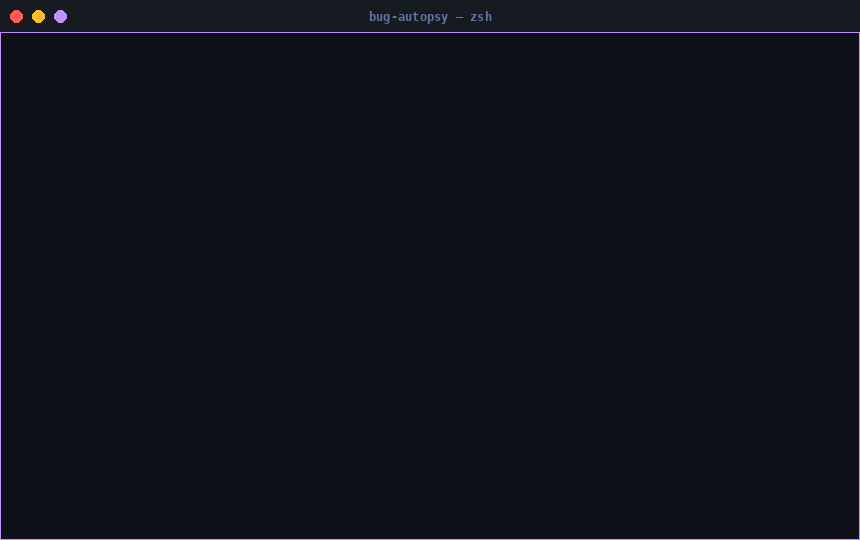

<div align="center">

```
██████╗ ██╗   ██╗ ██████╗      █████╗ ██╗   ██╗████████╗ ██████╗ ██████╗ ███████╗██╗   ██╗
██╔══██╗██║   ██║██╔════╝     ██╔══██╗██║   ██║╚══██╔══╝██╔═══██╗██╔══██╗██╔════╝╚██╗ ██╔╝
██████╔╝██║   ██║██║  ███╗    ███████║██║   ██║   ██║   ██║   ██║██████╔╝███████╗ ╚████╔╝ 
██╔══██╗██║   ██║██║   ██║    ██╔══██║██║   ██║   ██║   ██║   ██║██╔═══╝ ╚════██║  ╚██╔╝  
██████╔╝╚██████╔╝╚██████╔╝    ██║  ██║╚██████╔╝   ██║   ╚██████╔╝██║     ███████║   ██║   
╚═════╝  ╚═════╝  ╚═════╝     ╚═╝  ╚═╝ ╚═════╝    ╚═╝    ╚═════╝ ╚═╝     ╚══════╝   ╚═╝  
```

**Stop squinting at tracebacks. Get a diagnosis.**

<br/>

[](https://pypi.org/project/bug-autopsy/)
[](https://python.org)
[](LICENSE)
[](#running-tests)
[](#install)
[](https://pypi.org/project/bug-autopsy/)

[](README_ru.md)

<br/>

</div>

---

<div align="center">

## One command. Full diagnosis.

```bash
python my_script.py 2>&1 | autopsy
```

</div>

<div align="center">



</div>

---

##  &nbsp;Why Bug Autopsy?

You're in CI. It failed. There's a wall of red.

You scroll past 80 lines of stacktrace, find the exception, Google it, open a Stack Overflow tab from 2016, read it, decide it's probably not your case, open another tab —

**Or** you run one command and get this:

```
╔══════════════════════════════════════════╗
║         [~]  B U G   A U T O P S Y      ║
╚══════════════════════════════════════════╝
  2 error(s) detected

┌─ [1] KeyError                                         95% confidence
│  Message   : KeyError: 'url'
│  Context   : Database / ORM
│
│  [brain] Root Cause
│     The key 'url' is missing from the dictionary at access time.
│     The config structure doesn't contain this key in this scope.
│
│  [pin] Exact Location
│     • startup()           →  /srv/api/main.py:47
│       db_url = config['database']['url']
│     • fallback_connect()  →  /srv/api/db.py:18
│
│  [wrench] Fixes
│   1. Use .get() with a default:  value = d.get('url', fallback)
│   2. Check for typos — keys are case-sensitive.
│   3. Verify the key is populated before access.
│   4. Guard with:  if 'url' in d:  before accessing.
└────────────────────────────────────────────────────────────────────
```

Root cause. Exact file and line. Four concrete fixes. No googling.

---

##  &nbsp;Install

```bash
pip install bug-autopsy
```

> No API keys. No network calls. No mandatory dependencies.  
> Works on Python 3.9+, Windows / Linux / macOS.

---

##  &nbsp;Usage

| What you want | Command |
|---|---|
| Analyse a log file | `autopsy --file path/to/error.log` |
| Analyse inline text | `autopsy --text "ModuleNotFoundError: No module named 'requests'"` |
| Pipe from your program | `python my_script.py 2>&1 \| autopsy` |
| Save a Markdown report | `autopsy --file crash.log --report report.md` |
| CI-friendly (no colour) | `autopsy --file crash.log --no-color` |
| Report only, no console | `autopsy --file crash.log --quiet --report report.md` |

---

##  &nbsp;Markdown reports

```bash
autopsy --file crash.log --report report.md
```

Generates a full structured report, ready to paste into GitHub Issues, Notion, or your postmortem doc:

```markdown
# Bug Autopsy Report

**Generated:** 2025-01-15 14:32:01  
**Source:** `crash.log`  
**Errors found:** 2

| # | Error Type | Confidence        | Environment    |
|---|------------|-------------------|----------------|
| 1 | KeyError   | ████████████ 95%  | Database / ORM |
| 2 | TypeError  | ███████████░ 92%  | Database / ORM |

## Error 1: `KeyError`
...
```

---

##  &nbsp;What it detects

<table>
<tr>
<td>

 &nbsp;**Import & Module**
- `ModuleNotFoundError`
- `ImportError`

 &nbsp;**Data Structures**
- `KeyError`
- `IndexError`
- `AttributeError`

 &nbsp;**Types & Values**
- `TypeError`
- `ValueError`
- `NameError`

</td>
<td>

 &nbsp;**Runtime**
- `RuntimeError`
- `RecursionError`
- `AssertionError`
- `StopIteration`
- `ZeroDivisionError`

 &nbsp;**System**
- `PermissionError`
- `FileNotFoundError`
- `OSError`
- `MemoryError`
- `TimeoutError`
- `UnicodeDecodeError`

</td>
</tr>
</table>

---

##  &nbsp;Environment detection

Bug Autopsy reads the context of your error — not just the type — and tailors explanations accordingly.

| Detected environment | Trigger |
|---|---|
| **Flask** | `flask`, `werkzeug`, `Blueprint` |
| **FastAPI** | `fastapi`, `uvicorn`, `APIRouter` |
| **Django** | `django`, `wsgi`, `migrations` |
| **pytest / unittest** | `pytest`, `unittest`, `TestCase` |
| **SQLAlchemy / DB** | `sqlalchemy`, `psycopg2`, `sqlite3` |
| **Data science / ML** | `pandas`, `numpy`, `torch`, `sklearn` |
| **Celery / workers** | `celery`, `dramatiq`, `rq` |
| **AWS / cloud** | `boto3`, `lambda_handler` |

---

##  &nbsp;Python API

Use Bug Autopsy as a library inside your own tools, CI scripts, or error handlers:

```python
from autopsy.analyzer import analyze
from autopsy import report as report_mod

log_text = open("crash.log").read()
results = analyze(log_text)

for r in results:
    print(f"[{r.error_type}] {r.confidence:.0%} — {r.context}")
    print(r.explanation)
    for fix in r.fixes:
        print(f"  • {fix}")

# Save a Markdown report
md = report_mod.generate(results, source_label="crash.log")
report_mod.save(md, "autopsy_report.md")
```

**`DiagnosticResult` fields:**

```python
r.error_type    # "KeyError"
r.message       # raw matched line from the log
r.confidence    # float 0.0–1.0
r.explanation   # human-readable root cause description
r.fixes         # list[str] of concrete recommendations
r.context       # inferred environment: "Flask", "pytest", "Database / ORM", …
r.frames        # list of parsed stack frames (file, line, function, source)
r.raw_excerpt   # surrounding log lines for context
```

---

##  &nbsp;Project structure

```
bug-autopsy/
├── autopsy/
│   ├── analyzer.py     # Core: parsing, detection, classification
│   ├── cli.py          # Command-line interface
│   └── report.py       # Markdown report generation
├── examples/
│   ├── module_not_found.log
│   ├── multi_error.log
│   ├── flask_error.log
│   └── sample_report.md
├── tests/
│   ├── test_analyzer.py
│   └── test_report.py
└── pyproject.toml
```

---

##  &nbsp;Running tests

```bash
# Install with dev dependencies
pip install -e ".[dev]"

# Run all tests
pytest

# With coverage report
pytest --cov=autopsy --cov-report=term-missing
```

**39 tests** passing on Python 3.9 – 3.12 across Windows, Linux, macOS.

---

##  &nbsp;Roadmap

- [ ] **AI mode** — LLM-powered explanations for rare or ambiguous errors
- [ ] **GitHub Issues analyser** — diagnose bugs directly from issue tracker
- [ ] **Auto-reproduction sandbox** — isolate and reproduce errors automatically
- [ ] **Patch suggestions** — generate candidate fixes as diffs
- [ ] **Web dashboard** — FastAPI-based UI for team use

---

##  &nbsp;Contributing

```bash
git clone https://github.com/yourname/bug-autopsy
cd bug-autopsy
pip install -e ".[dev]"
pytest
```

Bug reports, feature requests and PRs are welcome.  
Open an issue first for anything non-trivial.

---

<div align="center">

<br/>

**If Bug Autopsy saved you a debugging session — a  helps other developers find it.**

<br/>

[](https://github.com/yourname/bug-autopsy)
&nbsp;
[](https://pypi.org/project/bug-autopsy/)
&nbsp;
[](https://github.com/yourname/bug-autopsy/issues/new)

<br/>
<br/>

</div>
