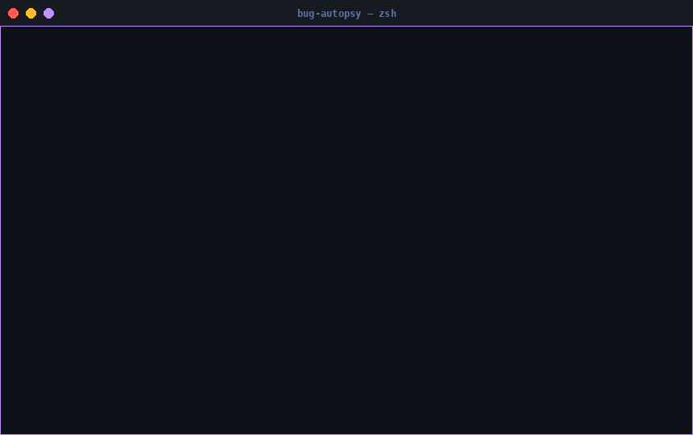

<div align="center">

```
██████╗ ██╗   ██╗ ██████╗      █████╗ ██╗   ██╗████████╗ ██████╗ ██████╗ ███████╗██╗   ██╗
██╔══██╗██║   ██║██╔════╝     ██╔══██╗██║   ██║╚══██╔══╝██╔═══██╗██╔══██╗██╔════╝╚██╗ ██╔╝
██████╔╝██║   ██║██║  ███╗    ███████║██║   ██║   ██║   ██║   ██║██████╔╝███████╗ ╚████╔╝ 
██╔══██╗██║   ██║██║   ██║    ██╔══██║██║   ██║   ██║   ██║   ██║██╔═══╝ ╚════██║  ╚██╔╝  
██████╔╝╚██████╔╝╚██████╔╝    ██║  ██║╚██████╔╝   ██║   ╚██████╔╝██║     ███████║   ██║   
╚═════╝  ╚═════╝  ╚═════╝     ╚═╝  ╚═╝ ╚═════╝    ╚═╝    ╚═════╝ ╚═╝     ╚══════╝   ╚═╝  
```

**Хватит щуриться на трейсбеки. Получи диагноз.**

<br/>

[](https://pypi.org/project/bug-autopsy/)
[](https://python.org)
[](LICENSE)
[](#запуск-тестов)
[](#установка)
[](https://pypi.org/project/bug-autopsy/)

[](README.md)

<br/>

</div>

---

<div align="center">

## Одна команда. Полный диагноз.

```bash
python my_script.py 2>&1 | autopsy
```

</div>

<div align="center">



</div>

---

##  &nbsp;Зачем Bug Autopsy?

CI упал. В логах — стена красного текста.

Ты скроллишь 80 строк стектрейса, находишь исключение, гуглишь его, открываешь вкладку Stack Overflow из 2016 года, читаешь, решаешь что, скорее всего, не твой случай, открываешь ещё одну вкладку —

**Или** запускаешь одну команду и получаешь это:

```
╔══════════════════════════════════════════╗
║         [~]  B U G   A U T O P S Y      ║
╚══════════════════════════════════════════╝
  Обнаружено ошибок: 2

┌─ [1] KeyError                                         уверенность: 95%
│  Сообщение  : KeyError: 'url'
│  Окружение  : Database / ORM
│
│  [brain] Корневая причина
│     Ключ 'url' отсутствует в словаре в момент обращения.
│     Структура конфига не содержит этот ключ в данной области видимости.
│
│  [pin] Точное место
│     • startup()           →  /srv/api/main.py:47
│       db_url = config['database']['url']
│     • fallback_connect()  →  /srv/api/db.py:18
│
│  [wrench] Исправления
│   1. Используй .get() с дефолтом:  value = d.get('url', fallback)
│   2. Проверь опечатки — ключи чувствительны к регистру.
│   3. Убедись, что ключ заполнен до обращения.
│   4. Добавь проверку:  if 'url' in d:  перед доступом.
└────────────────────────────────────────────────────────────────────
```

Корневая причина. Точный файл и строка. Четыре конкретных фикса. Без гугла.

---

##  &nbsp;Установка

```bash
pip install bug-autopsy
```

> Без API-ключей. Без сетевых запросов. Без обязательных зависимостей.  
> Работает на Python 3.9+, Windows / Linux / macOS.

---

##  &nbsp;Использование

| Что нужно | Команда |
|---|---|
| Анализ файла с логами | `autopsy --file path/to/error.log` |
| Анализ текста ошибки | `autopsy --text "ModuleNotFoundError: No module named 'requests'"` |
| Пайп из программы | `python my_script.py 2>&1 \| autopsy` |
| Сохранить Markdown-отчёт | `autopsy --file crash.log --report report.md` |
| Режим CI (без цвета) | `autopsy --file crash.log --no-color` |
| Только отчёт, без консоли | `autopsy --file crash.log --quiet --report report.md` |

---

##  &nbsp;Markdown-отчёты

```bash
autopsy --file crash.log --report report.md
```

Генерирует полный структурированный отчёт — вставляй в GitHub Issues, Notion или в документ постмортема:

```markdown
# Bug Autopsy Report

**Сгенерирован:** 2025-01-15 14:32:01  
**Источник:** `crash.log`  
**Найдено ошибок:** 2

| # | Тип ошибки | Уверенность       | Окружение      |
|---|------------|-------------------|----------------|
| 1 | KeyError   | ████████████ 95%  | Database / ORM |
| 2 | TypeError  | ███████████░ 92%  | Database / ORM |

## Ошибка 1: `KeyError`
...
```

---

##  &nbsp;Что обнаруживает

<table>
<tr>
<td>

 &nbsp;**Импорт и модули**
- `ModuleNotFoundError`
- `ImportError`

 &nbsp;**Структуры данных**
- `KeyError`
- `IndexError`
- `AttributeError`

 &nbsp;**Типы и значения**
- `TypeError`
- `ValueError`
- `NameError`

</td>
<td>

 &nbsp;**Выполнение**
- `RuntimeError`
- `RecursionError`
- `AssertionError`
- `StopIteration`
- `ZeroDivisionError`

 &nbsp;**Система**
- `PermissionError`
- `FileNotFoundError`
- `OSError`
- `MemoryError`
- `TimeoutError`
- `UnicodeDecodeError`

</td>
</tr>
</table>

---

##  &nbsp;Определение окружения

Bug Autopsy читает контекст ошибки — не только её тип — и адаптирует объяснения под него.

| Окружение | Ключевые слова |
|---|---|
| **Flask** | `flask`, `werkzeug`, `Blueprint` |
| **FastAPI** | `fastapi`, `uvicorn`, `APIRouter` |
| **Django** | `django`, `wsgi`, `migrations` |
| **pytest / unittest** | `pytest`, `unittest`, `TestCase` |
| **SQLAlchemy / БД** | `sqlalchemy`, `psycopg2`, `sqlite3` |
| **Data science / ML** | `pandas`, `numpy`, `torch`, `sklearn` |
| **Celery / воркеры** | `celery`, `dramatiq`, `rq` |
| **AWS / облако** | `boto3`, `lambda_handler` |

---

##  &nbsp;Python API

Используй Bug Autopsy как библиотеку внутри своих инструментов, CI-скриптов или обработчиков ошибок:

```python
from autopsy.analyzer import analyze
from autopsy import report as report_mod

log_text = open("crash.log").read()
results = analyze(log_text)

for r in results:
    print(f"[{r.error_type}] {r.confidence:.0%} — {r.context}")
    print(r.explanation)
    for fix in r.fixes:
        print(f"  • {fix}")

# Сохранить Markdown-отчёт
md = report_mod.generate(results, source_label="crash.log")
report_mod.save(md, "autopsy_report.md")
```

**Поля `DiagnosticResult`:**

```python
r.error_type    # "KeyError"
r.message       # исходная совпавшая строка из лога
r.confidence    # float 0.0–1.0
r.explanation   # описание корневой причины
r.fixes         # list[str] — конкретные рекомендации
r.context       # определённое окружение: "Flask", "pytest", "Database / ORM", …
r.frames        # распарсенные фреймы стека (файл, строка, функция, код)
r.raw_excerpt   # окружающие строки лога для контекста
```

---

##  &nbsp;Структура проекта

```
bug-autopsy/
├── autopsy/
│   ├── analyzer.py     # Ядро: парсинг, детекция, классификация
│   ├── cli.py          # Интерфейс командной строки
│   └── report.py       # Генерация Markdown-отчётов
├── examples/
│   ├── module_not_found.log
│   ├── multi_error.log
│   ├── flask_error.log
│   └── sample_report.md
├── tests/
│   ├── test_analyzer.py
│   └── test_report.py
└── pyproject.toml
```

---

##  &nbsp;Запуск тестов

```bash
# Установка с dev-зависимостями
pip install -e ".[dev]"

# Все тесты
pytest

# С отчётом покрытия
pytest --cov=autopsy --cov-report=term-missing
```

**39 тестов** проходят на Python 3.9 – 3.12 на Windows, Linux, macOS.

---

##  &nbsp;Дорожная карта

- [ ] **AI-режим** — объяснения через LLM для редких или неоднозначных ошибок
- [ ] **Анализатор GitHub Issues** — диагностика прямо из трекера задач
- [ ] **Песочница воспроизведения** — автоматическая изоляция и воспроизведение ошибок
- [ ] **Предложение патчей** — генерация кандидатов на исправление в виде диффов
- [ ] **Веб-интерфейс** — FastAPI-дашборд для командного использования

---

##  &nbsp;Участие в разработке

```bash
git clone https://github.com/yourname/bug-autopsy
cd bug-autopsy
pip install -e ".[dev]"
pytest
```

Баг-репорты, запросы фич и PR — приветствуются.  
Для нетривиальных изменений сначала открой Issue.

---

<div align="center">

<br/>

**Если Bug Autopsy сэкономил тебе сессию отладки —  поможет другим разработчикам его найти.**

<br/>

[](https://github.com/yourname/bug-autopsy)
&nbsp;
[](https://pypi.org/project/bug-autopsy/)
&nbsp;
[](https://github.com/yourname/bug-autopsy/issues/new)

<br/>
<br/>

</div>
